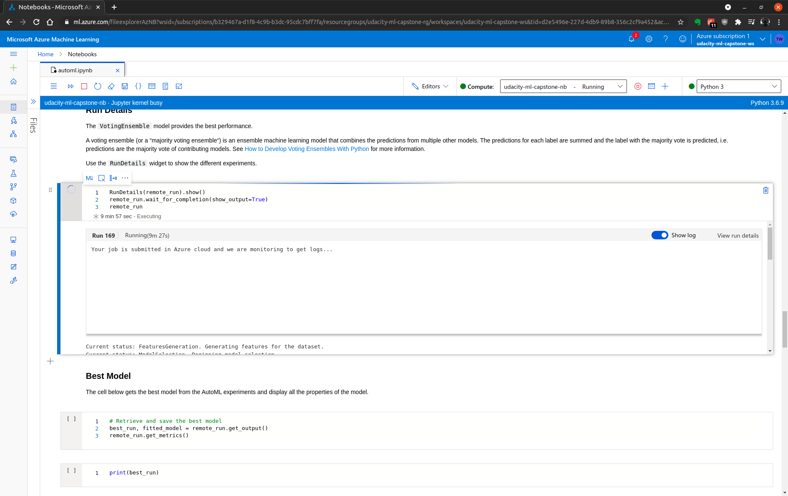
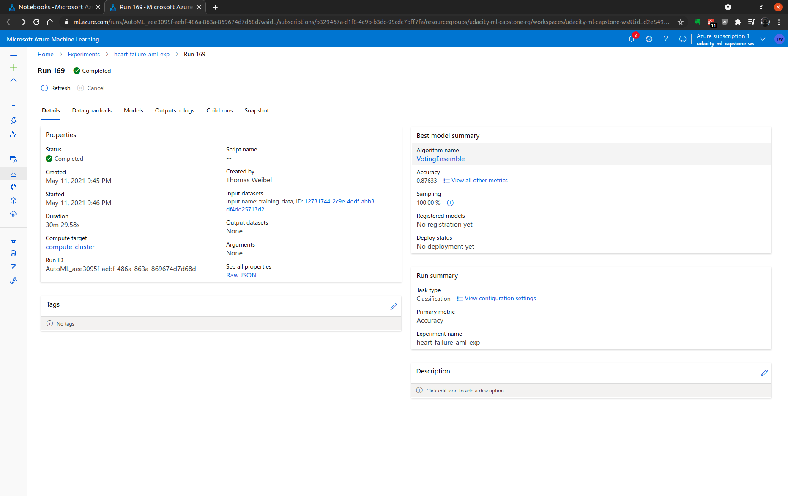
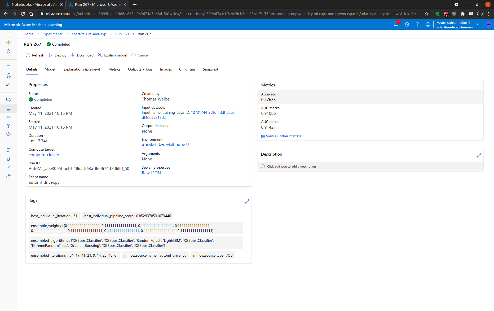
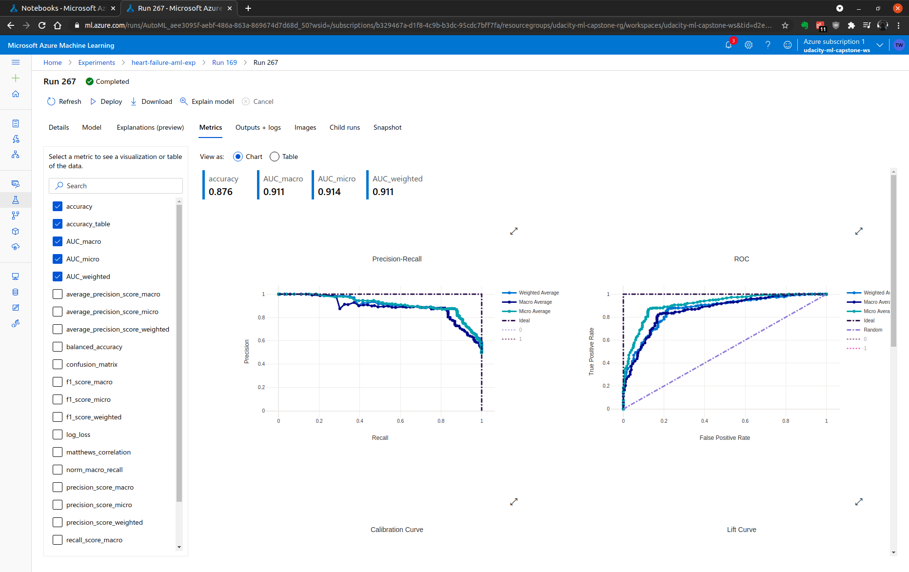
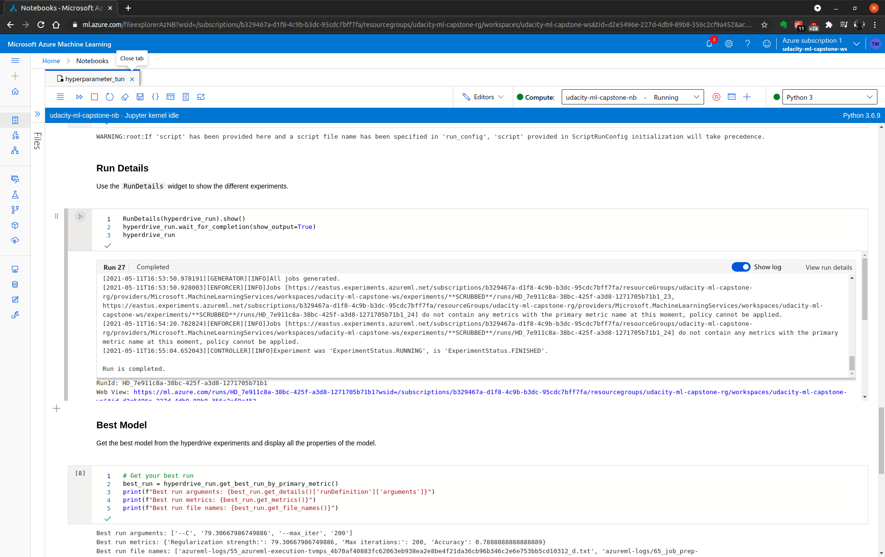
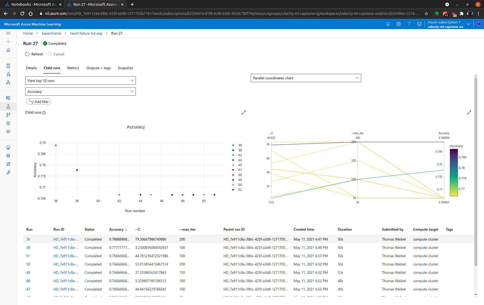
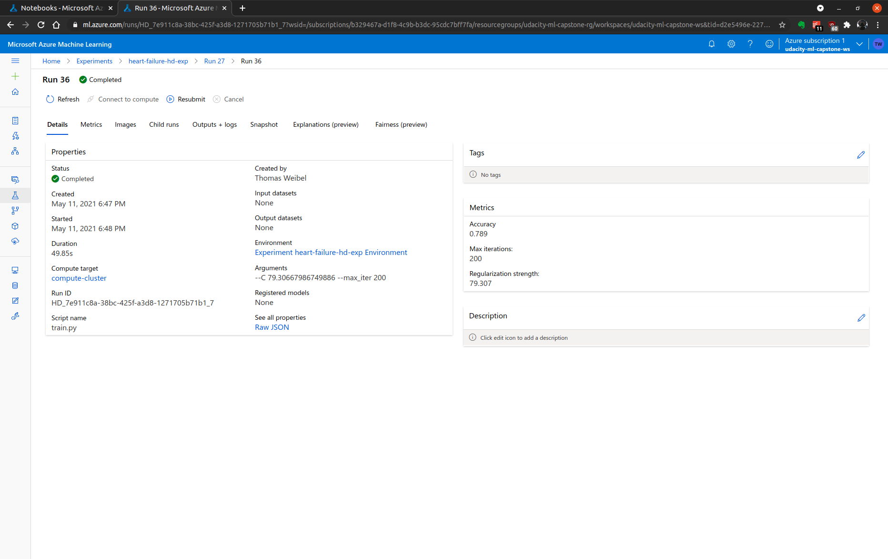
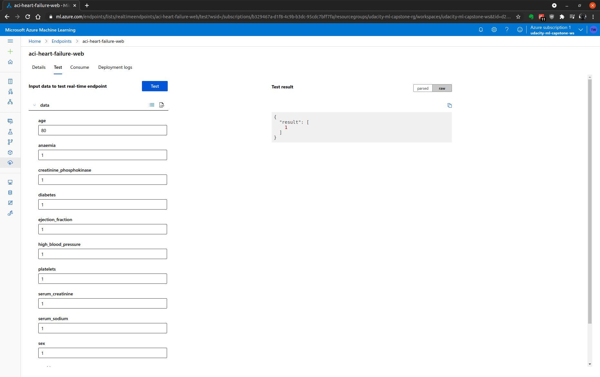
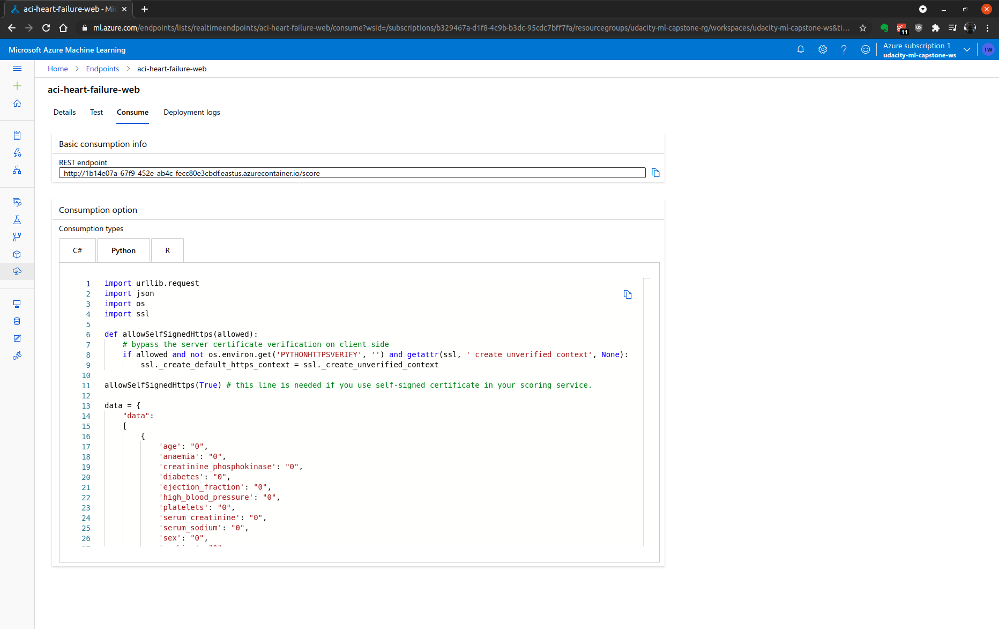

# Udacity Machine Learning Engineer with Microsoft Azure Nanodegree - Capstone Project: Azure Machine Learning Engineer

- [Introduction](#introduction)
- [Project setup and installation](#project-setup-and-installation)
- [Dataset](#dataset)
  - [Overview](#overview)
  - [Attribute Information](#attribute-information)
  - [Task](#task)
  - [Access](#access)
- [Automated ML](#automated-ml)
  - [Automated ML configuration](#automated-ml-configuration)
  - [Automated ML results](#automated-ml-results)
- [Hyperparameter tuning](#hyperparameter-tuning)
  - [Hyperparameter tuning configuration](#hyperparameter-tuning-configuration)
    - [Data collection, cleansing and splitting](#data-collection-cleansing-and-splitting)
    - [Hyperparameter sampling](#hyperparameter-sampling)
    - [Model training and testing](#model-training-and-testing)
    - [Applying early stopping policy](#applying-early-stopping-policy)
  - [Hyperparameter tuning results](#hyperparameter-tuning-results)
- [Model deployment](#model-deployment)
- [Demo](#demo)
- [Future work](#future-work)
- [References](#references)
- [Requirements](#requirements)
- [License](#license)

## Introduction

This project is the final capstone project of the Udacity Azure ML Nanodegree.

In this project, two models are created: one using Automated ML and one customized model whose hyperparameters are tuned using HyperDrive. The performance of the two models is then compared and the best performing model deployed.

This project demonstrates the usage of an external dataset, training a model using the different tools available in the AzureML framework as well as deploying the model as a web service.

The below picture provides and overview of the project workflow:


## Project setup and installation

In order to run the notebooks and create the experiments, the following setup is required:

1. Create a new workspace in [Azure ML Studio](https://ml.azure.com)
2. Create a new notebook and compute instance
3. Open a new notebook terminal and clone this repository

    ```bash
    git clone https://github.com/thom/azure-ml-engineer-capstone.git
    ```

4. Open `automl.ipynb` and `hyperparameter_tuning.ipynb` and execute the code cells

## Dataset

### Overview

The project uses the [heart failure clinical records dataset](https://archive.ics.uci.edu/ml/machine-learning-databases/00519/heart_failure_clinical_records_dataset.csv). This dataset contains the medical records of 299 patients who had heart failure, collected during their follow-up period, where each patient profile has 13 clinical features.

|                           |                                                                        |
| ------------------------- | ---------------------------------------------------------------------- |
| Dataset characteristics   | Multivariate                                                           |
| Number of instances       | 299                                                                    |
| Area                      | Life                                                                   |
| Attribute characteristics | Integer, Real                                                          |
| Number of attributes      | 13                                                                     |
| Associated tasks          | Classification, Regression, Clustering                                 |
| Missing values?           | N/A                                                                    |
| Source                    | https://archive.ics.uci.edu/ml/datasets/Heart+failure+clinical+records |

A detailed description of the dataset can be found in the dataset section of the ["Machine learning can predict survival of patients with heart failure from serum creatinine and ejection fraction alone"](https://bmcmedinformdecismak.biomedcentral.com/articles/10.1186/s12911-020-1023-5) paper.

### Attribute Information

Thirteen clinical features:

| Name                           | Description                                               | Unit             |
| ------------------------------ | --------------------------------------------------------- | ---------------- |
| Age                            | Age of the patient                                        | Years            |
| Anaemia                        | Decrease of red blood cells or hemoglobin                 | Boolean          |
| High blood pressure            | If the patient has hypertension                           | Boolean          |
| Creatinine phosphokinase (CPK) | Level of the CPK enzyme in the blood                      | mcg/L            |
| Diabetes                       | If the patient has diabetes                               | Boolean          |
| Ejection fraction              | Percentage of blood leaving the heart at each contraction | Percentage       |
| Platelets                      | Platelets in the blood                                    | kiloplatelets/mL |
| Sex                            | Woman or man                                              | Binary           |
| Serum creatinine               | Level of serum creatinine in the blood                    | mg/dL            |
| Serum sodium                   | Level of serum sodium in the blood                        | mEq/L            |
| Smoking                        | If the patient smokes or not                              | Boolean          |
| Time                           | Follow-up period                                          | Days             |
| Death event (target)           | If the patient deceased during the follow-up period       | Boolean          |

### Task

This project tries to predict the binary class for the target/label `DEATH_EVENT` using supervised machine learning. `DEATH_EVENT` is the mortality caused by heart failure. All the features in the dataset are used.

### Access

The Azure Auto ML notebook reads the data using `Dataset.Tabular.from_delimeted_files()` and registers is as an Azure tabular dataset in the workspace.

For the hyperparameter tuning, the data is loaded into the workspace using `TabularDataFactory` in the `train.py` script.

## Automated ML

### Automated ML configuration

Overview of the AutoML settings and configuration used for this experiment:

| Property                     | Value                  | Description                                                                                                                      |
| ---------------------------- | ---------------------- | -------------------------------------------------------------------------------------------------------------------------------- |
| `experiment_timeout_minutes` | `60`                   | Maximum amount of time in hours that all iterations combined can take before the experiment terminates                           |
| `max_concurrent_iterations`  | `5`                    | Represents the maximum number of iterations that would be executed in parallel, should be less or equal to the number of cores   |
| `n_cross_validation`         | `5`                    | How many cross validations to perform when user validation data is not specified                                                 |
| `primary_metric`             | `accuracy`             | The metric that Automated Machine Learning will optimize for model selection                                                     |
| `compute_target`             | `compute_cluster_name` | The Azure Machine Learning compute target to run the Automated Machine Learning experiment on                                    |
| `task`                       | `classification`       | The type of task to run                                                                                                          |
| `training_data`              | `dataset`              | The training data to be used within the experiment, it contains both training features and a label column                        |
| `label_column_name`          | `DEATH_EVENT`          | The name of the label column                                                                                                     |
| `path`                       | `project_folder`       | The full path to the Azure Machine Learning project folder                                                                       |
| `enable_early_stopping`      | `True`                 | Whether to enable early termination if the score is not improving in the short term                                              |
| `featurization`              | `auto`                 | Indicator for whether featurization step should be done automatically or not, or whether customized featurization should be used |
| `debug_log`                  | `automl_errors.log`    | The log file to write debug information to                                                                                       |

```python
# AutoML settings
automl_settings = {
    "experiment_timeout_minutes": 60,
    "max_concurrent_iterations": 5,
    "n_cross_validations": 5,
    "primary_metric" : 'accuracy'
}

# AutoML configuration
automl_config = AutoMLConfig(
    compute_target=compute_cluster_name,
    task="classification",
    training_data=dataset,
    label_column_name="DEATH_EVENT",   
    path=project_folder,
    enable_early_stopping=True,
    featurization='auto',
    debug_log='automl_errors.log',
    **automl_settings
    )
```

### Automated ML results

The Voting Ensemble model performs the best and provides an accuracy of 87.63%.

AutoML `RunDetails`:



Best model trained:







 The following could be done to improve the AutoML model:

- Feature engineering should also lead to better model performance (see [Feature engineering in machine learning](https://docs.microsoft.com/en-us/azure/machine-learning/team-data-science-process/create-features) and [Data featurization in automated machine learning](https://docs.microsoft.com/en-us/azure/machine-learning/how-to-configure-auto-features))
- Increasing AutoML experiment timeout: Enables more model testing and evaluation to come up with better performance metrics
- Increase the number of cross validation to improve model accuracy

## Hyperparameter tuning

For the HyperDrive experiment, we chose the [`LogisticRegression`](https://scikit-learn.org/stable/modules/generated/sklearn.linear_model.LogisticRegression.html) classifier from scikit-learn.

The script `train.py` takes care of data collection, cleansing and splitting, model training and testing. Hyperparameter sampling and applying the early stopping policy is performed by HyperDrive.

### Hyperparameter tuning configuration

#### Data collection, cleansing and splitting

The dataset is loaded using `TabularDatasetFactory`. The cleansing process drops rows with empty values and performs one hot encoding for categorical columns (our dataset does not have any). The dataset is split into train and test sets. 70% of the data is used for training and 30% for testing.

#### Hyperparameter sampling

The project uses two hyperparameters:

- `--C`: inverse regularization strength
- `--max_iter`: maximum iteration to converge for the scikit-learn Logistic Regression model

I use [random parameter sampling](https://docs.microsoft.com/en-us/python/api/azureml-train-core/azureml.train.hyperdrive.randomparametersampling?view=azure-ml-py). Random sampling supports discrete and continuous hyperparameters. It supports early termination of low-performance runs. In random sampling, hyperparameter values are randomly selected from the defined search space. Random parameter sampling is good approach for discovery learning as well as hyperparameter combinations.

#### Model training and testing

Model training and testing is performed using scikit-learn's Logistical Regression model. In `train.py`, metrics are generated and logged. The accuracy is used to benchmark the model.

#### Applying early stopping policy

The execution of the pipeline is stopped if the conditions specified by the policy are met.

The model uses [BanditPolicy](https://docs.microsoft.com/en-us/python/api/azureml-train-core/azureml.train.hyperdrive.banditpolicy?view=azure-ml-py).

Bandit policy is based on slack factor/slack amount and evaluation interval. Bandit ends runs when the primary metric isn't within the specified slack factor/slack amount of the most successful run.

See [HyperDriveConfig Class](https://docs.microsoft.com/en-us/python/api/azureml-train-core/azureml.train.hyperdrive.hyperdriveconfig?view=azure-ml-py) for a complete list of configuration parameters.

### Hyperparameter tuning results

Tuning the hyperparameters of the [LogisticRegression](https://scikit-learn.org/stable/modules/generated/sklearn.linear_model.LogisticRegression.html) model using [Hyperdrive](https://docs.microsoft.com/en-us/python/api/azureml-train-core/azureml.train.hyperdrive?view=azure-ml-py) achieves an accuracy of 78.89% for a `C` value of 79.31 and `max_iter` value of 200.

HyperDrive `RunDetails`:



Best model trained:





Ways to improve the model:

- Increasing the `max_total_runs` value could improve the model performance
- Use a [different sampling method](https://docs.microsoft.com/en-us/azure/machine-learning/how-to-tune-hyperparameters) than random sampling:
  - Grid sampling supports discrete hyperparameters and does a simple grid search over all possible values
  - Bayesian sampling is based on the Bayesian optimization algorithm and picks samples based on how previous samples did, so that new samples improve the primary metric

## Model deployment

As the AutoML model performed better than the HyperDrive model, we registered this model, created an inference config and deployed it as a web service. We took the following steps:

1. Save the model, the scoring script and the conda environment of the best run
2. Register the model
3. Create an inference configuration
4. Define the deployment configuration
5. Deploy model as webservice using Azure Container Instance (ACI)

See [Deploy a model to Azure Container Instances](https://docs.microsoft.com/en-us/azure/machine-learning/how-to-deploy-azure-container-instance) for more information.

The notebook contains code to consume the webservice:

```python
import json
import requests

test_data = json.dumps({
    "data": [
        [55, 0, 1820, 0, 38, 0, 270000, 1.2, 139, 0, 0, 271],
        [55, 0, 1199, 0, 20, 0, 263358.03, 1.83,134, 1, 1, 241],
        [65, 1, 258, 1, 25, 0, 198000, 1.4, 129, 1, 0, 235],
        [50, 0, 196, 0, 45, 0, 395000, 1.6, 136, 1, 1, 285]
    ]})

response = requests.post(
    service.scoring_uri, 
    data=test_data, 
    headers={'Content-Type':'application/json'})

print("Results:", response.json())
```

It is also possible to call the webservice from endpoints:



Endpoints also offer the option to create a script for consumption:



## Demo

See [here](https://youtu.be/QzUeOo2u9ZY) for a video demonstrating the project.

## Future work

- Convert the model to ONNX format to allow for the model to more easily move between frameworks
- Deploy the model to the Edge using Azure IoT Edge
- Build a user interface for the webservice
- Perform feature engineering on the data
- Enable Deep Learning in AutoML to see if enabling it would yield better results

## References

- [What is automated machine learning (AutoML)?](https://docs.microsoft.com/en-us/azure/machine-learning/concept-automated-ml?view=azure-ml-py)
- [Hyperparameter tuning a model with Azure Machine Learning](https://docs.microsoft.com/en-us/azure/machine-learning/how-to-tune-hyperparameters?view=azure-ml-py)
- [Consume an Azure Machine Learning model deployed as a web service](https://docs.microsoft.com/en-us/azure/machine-learning/how-to-consume-web-service?view=azure-ml-py&tabs=python)
- [HyperDrive Deep Learning](https://github.com/microsoft/HyperdriveDeepLearning)
- [Davide Chicco, Giuseppe Jurman: "Machine learning can predict survival of patients with heart failure from serum creatinine and ejection fraction alone". BMC Medical Informatics and Decision Making 20, 16 (2020).](https://bmcmedinformdecismak.biomedcentral.com/articles/10.1186/s12911-020-1023-5)

## Requirements

Graded according to the [Project Rubric](https://review.udacity.com/#!/rubrics/2864/view).

## License

- **[MIT license](http://opensource.org/licenses/mit-license.php)**
- Copyright 2021 © [Thomas Weibel](https://github.com/thom).
